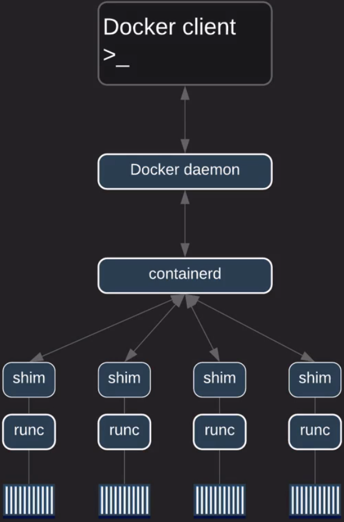

```
Преди да се инсталира докер, за всеки случай деинсталирайте 
програмата за да може да се махнат 
всички възможни ненужни пакети.
```
```
sudo yum remove -y docker \
docker-client \
docker-client-latest \
docker-common \
docker-latest \
docker-latest-logrotate \
docker-logrotate \
docker-engine
```

След това инсталирайте docker-ce (docker community edition)
```
sudo yum install -y yum-utils \
device-mapper-persistent-data \
lvm2
```
Сега трябва да се постараем да добавим стабилното хранилище (repository):
```
sudo yum -y install docker-ce
```
Трябва да включим и стартираме демона (сервиза) на докер:
```
sudo systemctl start docker && sudo systemctl enable docker
```
Добавете потребителя в групата на докер за може да ползвате услугата без да ползвате "sudo":
```
sudo usermod -aG docker {yourusername} (може да ползвате променливата за потребител $USER)
```
След като добавите потребителя, "bash" няма да знае, че вашият потребител е добавен в групата затова се разлогнете и логнете обратно.

Използвайте командата ```docker version``` , за да може да си потвърдите, че потребителя е добавен.

### Архитектура на "docker":


- Docker ползва клиент-сървър архитектура. Това означава, че демона на докер и клиента му са различни байнърита.
- Клиента може да се ползва за да комуникира с различни демони.
- Клиента се използва за да се ползват командите на докер.
- Демона на докер борави с:
  --Създаването
  --Работата
  --Дистрибуцията
 "Като цяло демона се справя с цялата тежка работа".
 
 Двата и демона и клиента използват REST API което може да се изпълнява по следния начин:
 
 - UNIX сокетите.
 - Мрежовата карта.

Тоест всеки път когато изпълните команда с докер. Демона изпраща заявка към REST API и
казва на докер демона какво да направи.

Демона на докер "dockerd":
Слуша за Docker API заявки и управлява docker обектите.

Обектите са:
- ```Images-изображения```
- ```Containers-Контейнерите```
- ```Networks-Мрежи```
- ```Volumes-Обеми```

Docker клиентът "docker" е как потребителите работят с Docker.
Клиента просто изпраща командите свързани с докер към dockerd.

Пример ```docker run ....``` .

### Когато започнем да си говорим за изображенията тогава ще дойде момента в който ще се използват "Docker registries"(Като GitHub само, че за Docker).

- Те се ползват за съхранение на Docker изображенията.
- Когато започнем да създаваме изображения ще дойде времето за "DockerHub" това е мястото където, ще можем да съхраним нашите изображения и е публично.

### Докер обекти:

-- Изображения -> 
- Файлове които са във формат четене-само с инструкций за създаване на Docker контейнер. - Тези инструкций са базирани на друго изображение. 
- Можем да си създадем наше си изображение.
- За да създадем изображение ние използваме Dockerfile.

-- Контейнери ->
- Контейнера е нищо повече от работеща инстанция на изображение. (ползвайки CLI на докер ще можете да създавате, стартирате и спирате контейнери.
- Можем да свързваме контейнерите (можем да ги наричаме кофи) с мержа и да ги обединяваме контейнери в една мрежа.
- Можем да закачим място за съхранение към контейнера с цел да не загубим данните които имаме върху контейнера.
- Можем да създадем ново изображение базирано върху работещ контейнер.
- Попринцип контейнерите са изолирани един от друг, както и от host-а, но не пречи да създадем взаимодействие между тях.

-- Сервизи -->
- Можем да скалираме "кофите" през няколко Docker демона. 
- Docker Swarm - можем да накараме няколко докер контейнера да работят заедно като включим тази функция. И всеки един от тези контейнери, ще бъде самостоятелен докер контейнер. "кофите" ще комуникират отново с Docker API.
- Дефинирането на желан статут -> ако един от контейнерите, се развали можем да нагласим автоматично да се създаде.
- Сервизите са load-balanced - това значи, че клъстара ще издържи на висок трафик.

--- Docker Swarm -->
- Няколко Docker демона работейки заедно (Masters and Workers).
- Всичките демони ще комуникират с Docker API. 


### Двигателят на Docker:

- Модулен дизайн
- Описан като " Батерийте са включени, но са заменими."
- Базиран е на отворените-стандарти от Open Container Initiative.
- Главните компоненти са:

``` --- Docker клиента```

``` --- Docker демона```

``` --- containerd```

``` --- runc```
- Всичките компоненти изброени отгоре работят заедно за да създават и движат контейнери.

### Малко история за Docker:

Първият release на докер е бил комбинация на две неща демона и lxc.
-- Демона:
- Docker клиент.
- Docker демон.
- Монолитно байнари.
- Docker API.
- Времето на изпълнение на контейнера.
- Builds на изображенията.
-- LXC:
- Namespaces.
- Контролни групи, cgroups.
- Linux специфично.

Как е изглеждала архитектурата преди:


`По нататък LXC е бил заменен с libcontainer`

Случва се във версия 0.9 и причинява на Docker повече щети от колкото ползи.
- монолитната среда на текущия демон е имал много проблеми.
- много е било трудно да бъде иновиран.
- двигателя на Docker е станал много бъгав и бавен.
- реално не се превръща в екосистемата която е желана от Docker INC.

За да го оправят се е наложило да разбият демона на докер на много по малки парчета се цел да стане много по модулярен.

Резултата е бил "pluggable" архитектура -> много по лесно вече е можело да се сменят 3d парти уредите в него.

Докато са правели рефакторинг на кода на докер се появява "Open Container Initiative".
Създадена е от Docker и други лидери в индрустрията с контейнеризацията. (2015)

Целта е била да се създаде лека система базирана на Линукс Фондацията и да се имплементират стандарти на високо ниво.

В момента Open Container Initative се състои от:
- Image Spec.
- Container runtime spec.

###В днешно време Docker изглежда така:

```runc```
- Имплементира OCI container-runtime-spec
- Леко CLI което обвива libcontainer.
- Целта му е да създава само контейнери.

Всичко останло с цел мениджмънта, манипулацията и контрола на контейнерите отива в containerd.

Съдържа функций като:
- Start
- Stop
- Pause
- Delete

containerd също отговаря за манипулацийте на Images.

### shims:

Използва се за опутребата на контейнери без демони.
Когато нов контейнер е създаден ```containerd``` създава инстанция на ```runc``` за вески нов контейнер. ``runc`` процес "излезa" (exits) само и само като контейнера е създаден. И след това ```shim``` процес става родителския процес за контейнера.
Това позволява да имаме стотици контейнери без да имаме стотици ```runc``` инстанций.

shim е отговорен за задържането на STDIN и STDOUT отворени.
Отговаря за отчета пред Docker демона.

### Когато създаваме контейнер ние използваме следната команда:

```docker container run -it --name <NAME> <IMAGE>:<TAG>```

### Какво се случва като пуснете тази команда е следното:

1. Ще ползваме CLI за да пуснем команда.
2. Docker клиента ще използва правилния API товар.
3. POSTs рикуест към правилния API endpoint.
4. Демона на Docker ще получи инструкций.
5. Docker демона ще повика containerd за да стартира нов контейнер.
6. Демона ползва gRPC което е (CRUD стил API).
7. containerd създава OCI пакет от Docker изображението.
8. След това казва на ```runc``` да създаде контейнер ползващ OCI пакета.
9. ```runc``` след това ще взаимодейства с ядрото на операционната система за да вземе конструкцията за създаване на контейнер.
10. Това включва cgroups, именното пространство и др.
11. Контейнер процеса стартира като процес дете.
12. Веднъж след като ```runc``` излезе стратира контейнера.
13. Което завършва процеса и контейнера вече работи.

Диаграма на създаването:




### Docker изображения:

- Шаблон за контейнерите ви.
- Ако имате опит с обектно ориентирано програмиране ги смятайте като класове.
- Контейнерите са инстанций на тези шаблони.
- Създадени са много-слойни.
- Те са build time конструкций, контейнерите са runtime constructs.
- Когато създадете контейнер от изображение (шаблон) те стават зависими едни от други.
- Изображенията са създани от Docker файлове които съдържат инструкций как контейнера трябва да бъде създаден. Примерно, ако ви трябва да ползвате Node.js ще трябва да назовете, че искате да имате node.js байнърито в контейнера.
- Както казахме, изображенията са създадени от много слоеве.
- Всеки слой показва инструкция в изображението което ще бъде създадено от Dockerfile.
- Всеки слой е read-write освен последния който е read-only.
- Всеки слой има комплект от разлики спрямо слоя преди него.
- Контейнерите добавят нов пишещ слой върху прилежащите слоеве.(контейнер слой)
- Всички промени направени върху работещ контейнер са направени върху контейнер слоя.

- Когато правите промени по "контейнер слоя", да речем искате да инсталирате vim, вие ще го инсталирате, но момента в който изстриете контейнера (destroy) този слой няма повече да съществува, тоест вашата промяна няма да бъде от значение и изображението няма да бъде променено.

### Docker Hub

- Публично хранилище.
- Предлножено е от докер.
- Лесен начин да споделяш изображения.
- Дава достъп то публични и частни хранилища, само едно дават да имаш всяко следващо е платено.
- Функцийте му съдържат:

-- ```Хранилище```

-- ```Teams and organizaitons ```

-- ```Официялни изображения```

-- ```Изображения от авторите```

-- ```Билдове всеки път в който се направи промяна по изображението ще може да се ъпдейнте и официялното ви изображение в Docker Hub```.


