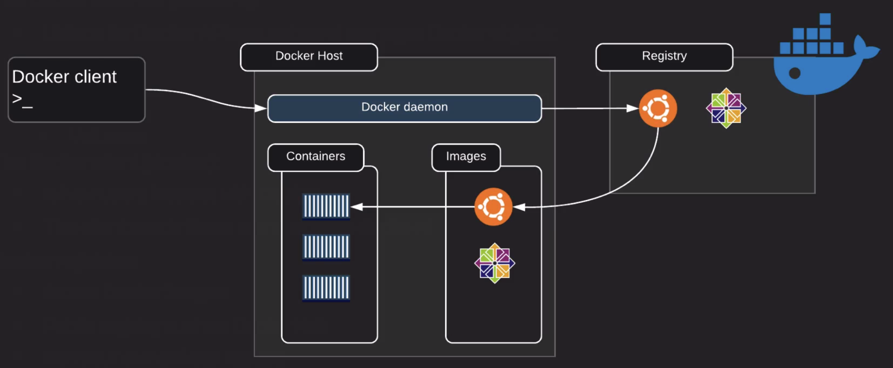
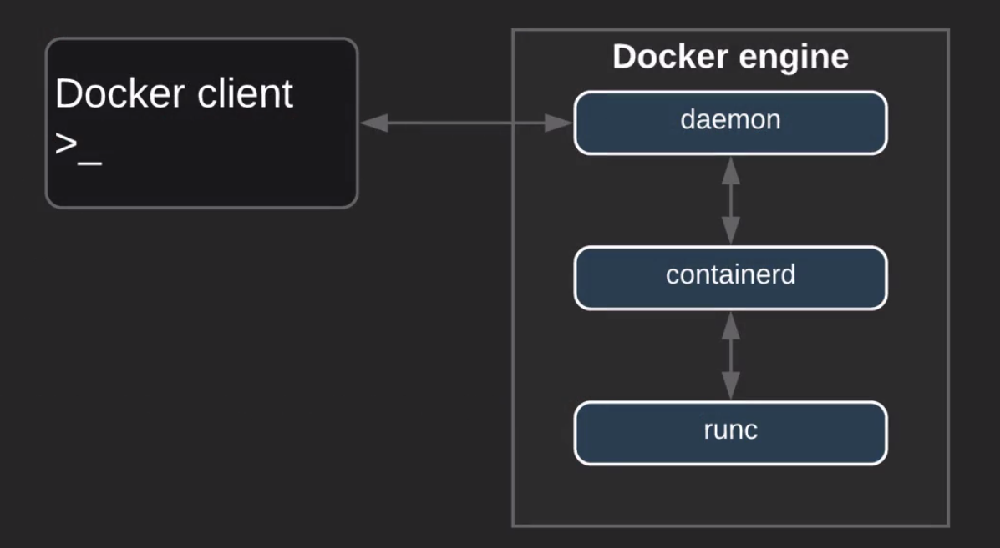
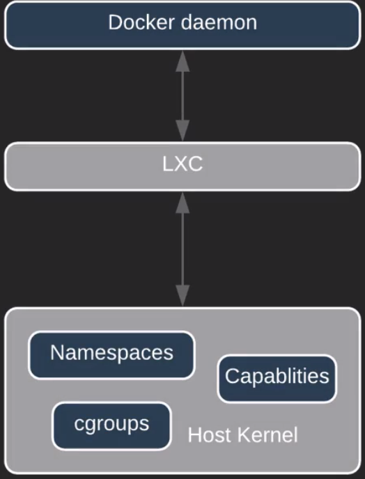

```
Преди да се инсталира докер, за всеки случай деинсталирайте 
програмата за да може да се махнат 
всички възможни ненужни пакети.
```
```
sudo yum remove -y docker \
docker-client \
docker-client-latest \
docker-common \
docker-latest \
docker-latest-logrotate \
docker-logrotate \
docker-engine
```

След това инсталирайте docker-ce (docker community edition)
```
sudo yum install -y yum-utils \
device-mapper-persistent-data \
lvm2
```
Сега трябва да се постараем да добавим стабилното хранилище (repository):
```
sudo yum -y install docker-ce
```
Трябва да включим и стартираме демона (сервиза) на докер:
```
sudo systemctl start docker && sudo systemctl enable docker
```
Добавете потребителя в групата на докер за може да ползвате услугата без да ползвате "sudo":
```
sudo usermod -aG docker {yourusername} (може да ползвате променливата за потребител $USER)
```
След като добавите потребителя, "bash" няма да знае, че вашият потребител е добавен в групата затова се разлогнете и логнете обратно.

Използвайте командата ```docker version``` , за да може да си потвърдите, че потребителя е добавен.

Архитектура на "docker":



- Docker ползва клиент-сървър архитектура. Това означава, че демона на докер и клиента му са различни байнърита.
- Клиента може да се ползва за да комуникира с различни демони.
- Клиента се използва за да се ползват командите на докер.
- Демона на докер борави с:
  --Създаването
  --Работата
  --Дистрибуцията
 "Като цяло демона се справя с цялата тежка работа".
 
 Двата и демона и клиента използват REST API което може да се изпълнява по следния начин:
 
 - UNIX сокетите.
 - Мрежовата карта.

Тоест всеки път когато изпълните команда с докер. Демона изпраща заявка към REST API и
казва на докер демона какво да направи.

Демона на докер "dockerd":
Слуша за Docker API заявки и управлява docker обектите.

Обектите са:
- ```Images-изображения```
- ```Containers-Контейнерите```
- ```Networks-Мрежи```
- ```Volumes-Обеми```

Docker клиентът "docker" е как потребителите работят с Docker.
Клиента просто изпраща командите свързани с докер към dockerd.

Пример ```docker run ....``` .

Когато започнем да си говорим за изображенията тогава ще дойде момента в който ще се използват "Docker registries"(Като GitHub само, че за Docker).

- Те се ползват за съхранение на Docker изображенията.
- Когато започнем да създаваме изображения ще дойде времето за "DockerHub" това е мястото където, ще можем да съхраним нашите изображения и е публично.

Докер обекти:

-- Изображения -> 
- Файлове които са във формат четене-само с инструкций за създаване на Docker контейнер. - Тези инструкций са базирани на друго изображение. 
- Можем да си създадем наше си изображение.
- За да създадем изображение ние използваме Dockerfile.

-- Контейнери ->
- Контейнера е нищо повече от работеща инстанция на изображение. (ползвайки CLI на докер ще можете да създавате, стартирате и спирате контейнери.
- Можем да свързваме контейнерите (можем да ги наричаме кофи) с мержа и да ги обединяваме контейнери в една мрежа.
- Можем да закачим място за съхранение към контейнера с цел да не загубим данните които имаме върху контейнера.
- Можем да създадем ново изображение базирано върху работещ контейнер.
- Попринцип контейнерите са изолирани един от друг, както и от host-а, но не пречи да създадем взаимодействие между тях.

-- Сервизи -->
- Можем да скалираме "кофите" през няколко Docker демона. 
- Docker Swarm - можем да накараме няколко докер контейнера да работят заедно като включим тази функция. И всеки един от тези контейнери, ще бъде самостоятелен докер контейнер. "кофите" ще комуникират отново с Docker API.
- Дефинирането на желан статут -> ако един от контейнерите, се развали можем да нагласим автоматично да се създаде.
- Сервизите са load-balanced - това значи, че клъстара ще издържи на висок трафик.

--- Docker Swarm -->
- Няколко Docker демона работейки заедно (Masters and Workers).
- Всичките демони ще комуникират с Docker API. 


Двигателят на Docker:

- Модулен дизайн
- Описан като " Батерийте са включени, но са заменими."
- Базиран е на отворените-стандарти от Open Container Initiative.
- Главните компоненти са:

``` --- Docker клиента```

``` --- Docker демона```

``` --- containerd```

``` --- runc```
- Всичките компоненти изброени отгоре работят заедно за да създават и движат контейнери.

Малко история за Docker:

Първият release на докер е бил комбинация на две неща демона и lxc.
-- Демона:
- Docker клиент.
- Docker демон.
- Монолитно байнари.
- Docker API.
- Времето на изпълнение на контейнера.
- Builds на изображенията.
-- LXC:
- Namespaces.
- Контролни групи, cgroups.
- Linux специфично.

Как е изглеждала архитектурата преди:



`По нататък LXC е бил заменен с libcontainer`


